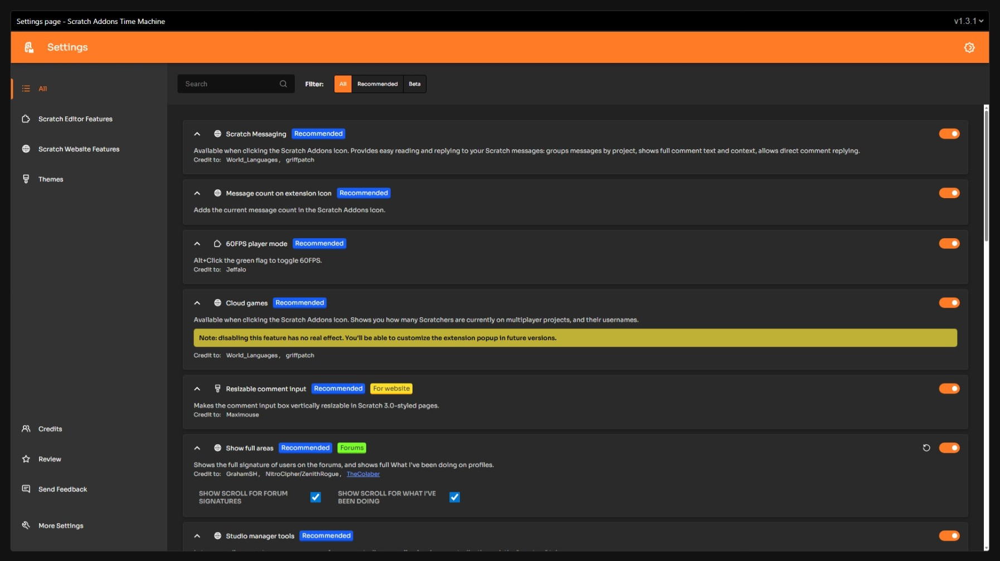

<div align="center">
  

  # Scratch Addons Time Machine

  Relive old Scratch Addons.
</div>


<i align="center">An image showing the settings page on version 1.3.1 in Scratch Addons Time Machine</i>

## About

Scratch Addons Time Machine is a ported collection of UI from past major versions of the [Scratch Addons browser extension](https://github.com/ScratchAddons/ScratchAddons). Using Time Machine, you can interact with nostalgic emulations of the popups and settings pages.

The plugins, called "addons", offered by Scratch Addons, are not functional in Time Machine, but you can still browse them.

Time Machine includes the following versions of Scratch Addons:
- 1.0.0
- 1.1.1
- 1.2.1
- 1.3.1
- 1.4.0
- 1.5.0
- 1.6.1
- 1.7.0
- 1.8.0
- 1.9.1
- 1.10.0
- 1.11.1
- 1.12.1

## Usage

Scratch Addons Time Machine is a browser extension and is currently only available in source code form. Once downloaded, you can install it using developer mode in your browser's Extensions menu.

## Motivation

Scratch Addons versions prior to 1.38.0 ran on Manifest V2, which lost support from major browsers in 2025. By bringing parts of these versions to a new [Manifest V3](https://developer.chrome.com/docs/extensions/develop/migrate/what-is-mv3) extension, Time Machine archives the classic UI, which got Scratch Addons to where it was today, for new audiences.

## For developers

### Technical overview

Scratch Addons Time Machine's source code contains addon data and settings page files organized by version number.

When the user selects a version using the settings page or popup containers, a few things happen at once:
- The version's corresponding addon files are retrieved from a database in [`/addons`](/addons), version-controlled by the [`changes.json`](/addons/changes.json) file. Events from the change list are processed up to the selected version, and the entries are used to load the latest revision of each addon manifest that still exists.
- An embed of the appropriate webpage is loaded. It receives the data resulting from the process described above so it can display the addons as they were in the version.

Here's where some of these processes are located:
- [`/ui/settings-pages.html`](/ui/settings-pages.html) — Loads the embeds of settings pages
- [`/ui/popup-pages.html`](/ui/popup-pages.html) — Loads the embeds of popup pages
- [`/background.js`](/background.js) — In addition to other background processes, sends responses to messages passed by the webpage embeds
- [`/services/get-addons.js`](/services/get-addons.js) — Finds the appropriate versions of each addon, and processes the data for use by the webpage embed
- [`/libraries/time-machine/page-wrapper.js`](/libraries/time-machine/page-wrapper.js) — Compatibility layers that help the webpage embed work properly in a foreign browser extension

### Adding versions

The general steps to add a version of Scratch Addons' webpages and addon collection to Time Machine using [Git](https://git-scm.com) and a code editor are as follows:

#### 0. Ensure that the latest version added to Time Machine has a complete list of changes.

In other words, you should complete all these steps before repeating the process to add another version, as they build on previous ones in a way that is difficult to change later.

#### 1. Note which [release version](https://github.com/ScratchAddons/ScratchAddons/releases) of Scratch Addons you want to add, and check out its tag.

Open a clone of Scratch Addons in your terminal, then use this command:
```shell
git checkout <tag_name>
```

> [!TIP]
> **Which patch release should I choose?** It is suggested to pick the version ending in ".0", unless that version was [pulled from production](https://github.com/ScratchAddons/ScratchAddons/pull/574) or a newer patch contains [bug fixes related to the UI](https://github.com/ScratchAddons/ScratchAddons/releases/tag/v1.3.1).

#### 2. Collect the cumulative changes between your chosen version and the previous version that is listed in Time Machine.

One way to see what has changed is to use this command in Scratch Addons after checkout:
```shell
git diff --name-status <previous_tag_name> HEAD
```

#### 3. Append a change list to `/addons/changes.json`. Include any addon manifests that were added, updated, or removed, based on the list from step 2.

You can ignore changes to `userscripts`, `userstyles`, `customCssVariables`, `persistentScripts`, `dynamicEnable`, `dynamicDisable`, and similar properties that don't have an effect on the content in the settings page.

The entry should look like this:
```json
{
  "version": "<version_number>",
  "added": { ... },
  "modified": { ... },
  "removed": { ... }
}
```

#### 4. Import any addon manifests that were added or modified from Scratch Addons into a new directory in Time Machine: `/addons/<version_number>`.

Copy each addon manifest to `/addons/<version_number>/<addon_id>.json`.

(This path is different than in Scratch Addons, where manifests are stored in `/addons/<addon_id>/addon.json`.)

#### 5. Import the popup window, popup tabs, and settings page from your chosen version of Scratch Addons into a new directory in Time Machine: `/pages/<version_number>`.

The Scratch Addons popup and settings pages are found in its `/webpages` directory, and the popup tabs are found in `/popups`. In Time Machine, however, they all go in the same directory, `/pages/<version_number>`.

Images from Scratch Addons are stored in Time Machine's `/images` directory. Shared code and libraries are stored in `/libraries`.

Make sure the links to these resources are updated whenever you add pages. Some examples:

| Path | Replacement |
|---|---|
| ../../images/icons/ | /images/scratch-addons/ |
| ../../libraries/ | /libraries/scratch-addons/ |
| ../../webpages/ | ../ |

Most of these paths can be fixed easily with a find/replace procedure.

All pages must also have a module import for `/libraries/time-machine/page-wrapper.js` or else they won't function as expected.

#### 6. Add the new version to the menu in both `/ui/settings-pages.html` and `/ui/popup-pages.html`.

Just add an `<option>` element to each drop-down menu. Newer versions go at the top.

#### 7. Use Time Machine to make sure everything is working.

Remember to save your changes, and check the new settings and popup pages in the extension by selecting the version from the menu.

### Common errors while testing

- `TypeError: Failed to fetch at get-addons.js` errors usually happen when one or more addon manifests are missing, misnamed, or in the wrong location. Review steps 3-4.
- Blank images and `net::ERR_FILE_NOT_FOUND` errors are usually caused by incorrect file paths. Review step 5.

### Checking your work

In case you make a mistake with a change list or addon manifest while adding a version, the `/ui/test.html` page will alert you of any discrepancies between the data in Time Machine and your Scratch Addons installation. To run the check, make sure you've copied and pasted at least `/ScratchAddons/addons` into Time Machine's own directory, then just open the extension's context menu and select _Debug → Check addon data_.

## Licenses

Scratch Addons Time Machine is available under [GNU General Public License v3](LICENSE) terms. Licenses for included software libraries can be found in the [`/licenses` directory](/licenses).
